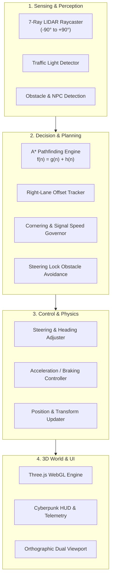

# 🚗 3D AI Self-Driving Car Simulator

An interactive, high-performance **3D Autonomous Vehicle Simulation** built with **Three.js** and **WebGL**. Experience autonomous navigation powered by the **A* Pathfinding Algorithm**, 7-directional **Raycasting Sensor Suites (LIDAR)** for obstacle avoidance, dynamic **Traffic Light Systems**, intelligent **NPC Vehicles**, and an expanding procedural 3D city.

[](https://chetanreddysai.github.io/Self-driving-3D-Car/)
[](https://threejs.org/)
[](https://developer.mozilla.org/en-US/docs/Web/JavaScript)
[](https://get.webgl.org/)
[](LICENSE)

> [!TIP]
> ### 🕹️ **[👉 Click Here to Play the 3D Simulator Live Online! 👈](https://chetanreddysai.github.io/Self-driving-3D-Car/)**
> *Runs instantly in your web browser with zero installation needed.*

---

## 🌟 Key Features

### 🧠 Autonomous Navigation & A* Pathfinding
- **Graph-Based Road Network**: Dynamically generates nodes across multi-lane grid roads for optimal route planning.
- **A* Algorithm Implementation**: Real-time evaluation of:
  $$\mathbf{f(n) = g(n) + h(n)}$$
  where $g(n)$ is the exact travel distance from the start node, and $h(n)$ is the Manhattan distance heuristic to the destination target.
- **Live A* Telemetry HUD**: Interactive sidebar displaying real-time $f(n)$, $g(n)$, and $h(n)$ cost bars, waypoint queue table, and path progress.
- **Lane Tracking & Cornering**: Automatic right-lane offset steering (`LANE_OFFSET = 2.5m`) with predictive corner-detection and deceleration curves.
- **Anti-Stuck Recovery**: Automated maneuver triggers and waypoint skipping if the vehicle gets blocked.

### 📡 7-Directional Raycast Sensor Suite (LIDAR Simulation)
- **Wide-Field Detection**: 7 raycasters radiating at $[-90^\circ, -60^\circ, -30^\circ, 0^\circ, 30^\circ, 60^\circ, 90^\circ]$ up to a range of **40 meters**.
- **Dynamic Obstacle Avoidance**: Raycast collision detection with directional steering lock and smooth lateral blending.
- **Visual Feedback**: Real-time color-coded laser beams (🟢 Safe → 🟡 Caution → 🔴 Critical) with 3D impact sphere markers and dedicated HUD distance gauges.

### 🚦 Smart City & Traffic Simulation
- **Synchronized Traffic Lights**: 3-phase light cycles (Green, Yellow, Red) controlling intersections. The AI car and NPCs actively detect signals and brake at stop lines.
- **Autonomous NPC Vehicles**: Multi-colored traffic cars navigating the grid, obeying traffic lights and lane directions.
- **Procedural City Expansion**: The urban map dynamically expands outward with new city segments, buildings, roads, and trees every 5 completed checkpoint deliveries.

### ⛽ Economy & Gameplay Mechanics
- **Fuel Consumption & Refueling**: Driving expends fuel; stop by interactive **Petrol Bunks** across the map to refill using in-game currency.
- **Dynamic Delivery Checkpoints**: Rotating target destinations reward currency ($₹$) and point milestones upon arrival.
- **Collision Physics & Penalty**: Obstacle impacts deduct currency, reduce AI fitness score, and trigger physical rebound dampening.

### 🎥 Multi-Camera & Dual Viewports
- **Chase Camera**: 3rd-person cinematic follow camera with smooth rotational damping.
- **Driver Cockpit View**: 1st-person immersive driver perspective.
- **Real-Time Minimap**: Picture-in-picture top-down orthographic radar camera rendered via WebGL scissor test.

---

## 🎮 Controls & Interface

| Control / Key | Action |
| :--- | :--- |
| **`↑` Arrow Up** | Accelerate / Drive Forward (Manual Mode) |
| **`↓` Arrow Down** | Reverse / Brake (Manual Mode) |
| **`←` / `→` Left / Right** | Steer Left / Right (Manual Mode) |
| **`🤖 ENABLE AI` Button** | Toggle between **Manual Driving** and **Autonomous AI Mode** |
| **`🎥 VIEW` Button** | Switch between **Chase Cam** and **Driver Cockpit View** |
| **`◈ ROUTE` Button** | Toggle A* path line visualization and live calculation HUD |
| **`◈ SENSORS` Button** | Toggle LIDAR laser beams and distance HUD visibility |

---

## 🏗️ System Architecture



---

## 🚀 Getting Started

No build tools or heavy installations required! The project uses native ES6 modules loaded via CDN.

### 1. Clone the Repository
```bash
git clone https://github.com/Chetanreddysai/Self-driving-3D-Car.git
cd Self-driving-3D-Car
```

### 2. Run with a Local Web Server

Because ES6 modules use `import`, the simulator must be served over HTTP/HTTPS:

#### Using Node.js:
```bash
npx serve .
```
*or*
```bash
npx live-server
```

#### Using Python 3:
```bash
python -m http.server 8000
```
Then open `http://localhost:8000` in your web browser.

#### Using VS Code:
Install the **Live Server** extension, right-click `indexdemo3.html`, and select **"Open with Live Server"**.

---

## 📁 Project Structure

```
Self-driving-3D-Car/
├── index.html         # Main entry point (GitHub Pages auto-deploy)
├── indexdemo3.html    # Demo entry point with responsive cyberpunk HUD UI
├── maindemo3.js       # Complete simulation logic (Three.js world, A*, LIDAR, AI controller)
├── .gitignore         # Git ignore rules
├── LICENSE            # MIT License
└── README.md          # Comprehensive documentation & mathematical breakdown
```

---

## 🔬 Mathematical Formulas Used

### 1. A* Cost Function
For any given waypoint node $n$:
$$f(n) = g(n) + h(n)$$
where:
- $g(n)$: Cumulative Euclidean distance along the road network from origin to node $n$.
- $h(n) = |x_n - x_{\text{dest}}| + |z_n - z_{\text{dest}}|$ (Manhattan Distance heuristic).

### 2. Right-Lane Offset Calculation
Given current waypoint $W_k$ and previous waypoint $W_{k-1}$ with displacement vector $(\Delta x, \Delta z)$:
$$L = \sqrt{\Delta x^2 + \Delta z^2}$$
$$\text{Target}_x = W_{k,x} + \left(-\frac{\Delta z}{L}\right) \cdot d_{\text{lane}}$$
$$\text{Target}_z = W_{k,z} + \left(\frac{\Delta x}{L}\right) \cdot d_{\text{lane}}$$
*(where $d_{\text{lane}} = 2.5\text{m}$)*

---

## 📜 License
This project is open-source and available under the [MIT License](LICENSE).
