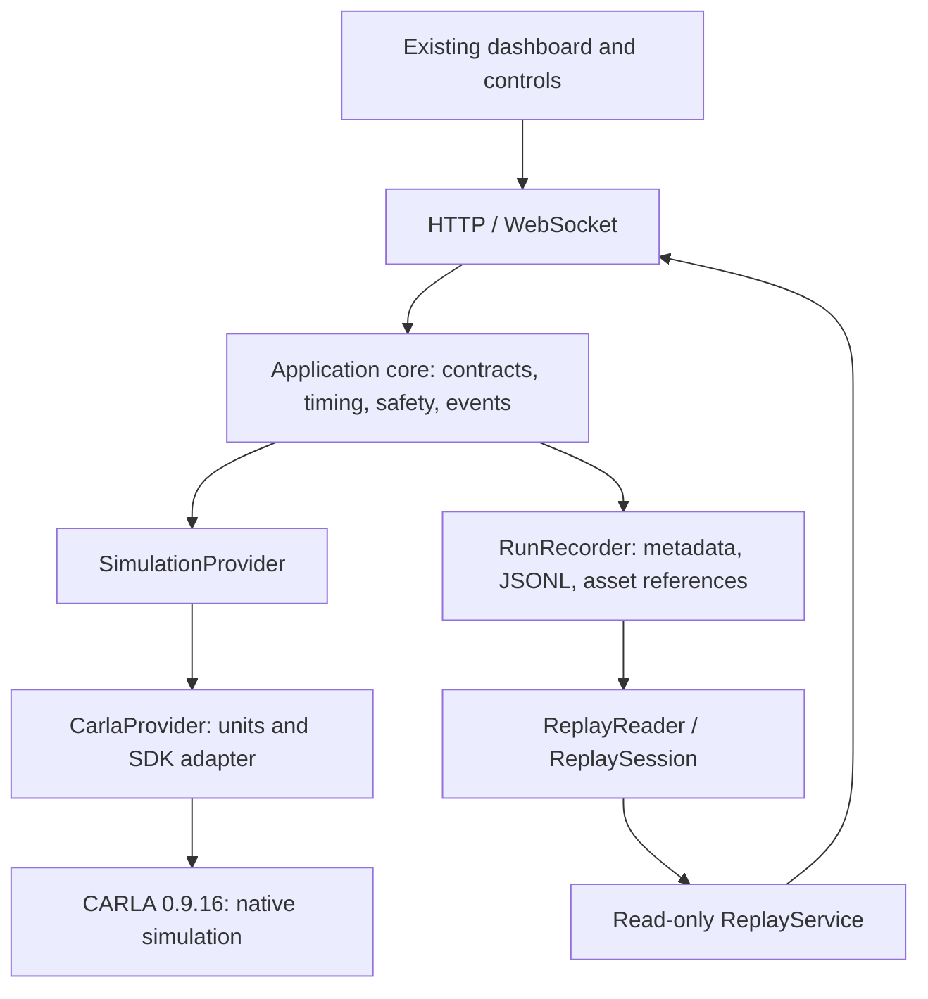

# Offline application core

Updated 7 October 2026. The active branch is `main`; the CARLA preparation branch
was merged at `d5b5132`. CARLA 0.9.16 remains the production target. Internet and
native installation are unavailable. **No installation/download was attempted
during this work. No physics, sensors, world, model or scenario was simulated.**

## Implementation sequence and architecture

1. Audit/reuse the existing WebSocket, HUD, controls, recording and adapter.
2. Add validated canonical contracts and independent timing/control modules.
3. Test those modules with explicitly identified deterministic data packets.
4. Connect the existing worker and recording boundary to those contracts.
5. Add read-only recorded Replay, lifecycle/logging, config/plugin boundaries.
6. Prepare native check entry points and document the remaining gates.



Replay does not implement SimulationProvider and has no control sink. The
application core imports no CARLA/BeamNG SDK, renderer or ML framework. Native
construction is lazy through `backend/providers.py`; native values are converted
to canonical contracts inside `backend/carla/contracts.py`. Existing CARLA raw
packet convenience methods remain inside that adapter for compatibility. The
service consumes only `get_simulation_frame()` and `apply_control()` contracts.

## Canonical contracts and units

`backend/core/contracts.py` supplies frozen dataclasses, strict JSON decoding,
unknown-field/type/range/NaN/Infinity rejection and nested round trips:

| Contract | Meaning |
| --- | --- |
| VehicleState | Native frame/time, transform, m/s velocity, rad/s angular velocity, m/s² acceleration, speed magnitude, applied normalized controls and gearbox state |
| ControlCommand | Referenced simulation frame/time, normalized pedals/steering, reverse/handbrake/optional gear and explicit source |
| SensorFrame | Sensor/actor ID, kind, transform, simulation and sensor timestamps, requested Hz, unit-labelled JSON measurements or file reference |
| CollisionEvent | Frame/time, ego/other IDs, impulse vector in N·s and coordinate frame; contact position optional, never invented |
| ActorState / WorldState | Frame/time and actor transforms/velocity or world identity/version/timestep |
| SimulationFrame / SynchronizedFrame | One coherent frame, vehicle/world/sensors/control/collisions/actors, completeness metadata and separate truth/prediction containers |
| ExperimentMetadata | Run identity, schema version, provider, REAL_SIMULATION or TEST_FIXTURE provenance and experiment config |

All timestamps named `timestamp_s` are **simulation seconds**, not Unix or host
wall-clock seconds. Host receipt/watchdog timing uses `time.monotonic()` separately.
Positions use meters, Euler roll/pitch/yaw use radians, acceleration uses m/s²,
angular velocity uses rad/s, impulse uses N·s, sensor rates use Hz. Every Transform
names its coordinate frame. The CARLA adapter explicitly preserves its native
left-handed X-forward/Y-right/Z-up convention rather than silently flipping axes.

`speed_mps` is nonnegative Euclidean magnitude; `longitudinal_speed_mps` is signed
native forward projection. Steering is normalized [-1,1], **positive right**,
not a physical tire angle. The existing browser's left-positive input is converted
once at the compatibility entry point. Canonical controls are converted back at
the native adapter; no steering/vehicle dynamics are recreated.

Sources: MANUAL, ASSISTED, AI, SAFETY, SYSTEM. Ground truth uses immutable
SimulatorGroundTruth/GroundTruthObject/ActorState. ModelPrediction has model/track
identity, class/confidence/estimated distance; it cannot overwrite truth fields.

## Timing and sensor synchronization

SimulationClock tracks the latest native world frame, simulation time and separate
host receipt time. FrameTracker detects missing ranges, late/out-of-order, stale,
duplicate and timestamp-inconsistent packets. A declared expected frame stride
supports slower sensors; gaps do not automatically imply a fault for a lower rate.

SensorSynchronizer accepts required/optional sensor IDs, timeout seconds, capacity
and per-sensor frame strides. Sensor callbacks may arrive before their vehicle
anchor or out of order. It joins only identical frame IDs and matching simulation
timestamps, and emits in frame order. Missing required sensors become explicit
`missing_required_sensors`; optional absence is listed separately. Timeout and
capacity eviction can produce incomplete anchored frames. Unanchored expired data
is discarded with diagnostics, never given a fabricated vehicle/world anchor.
Late packets cannot alter an already emitted frame. Pending/output buffers are
bounded; an undrained overflow is an explicit error. Unknown/invalid data never
gets fused with a neighbor frame.

The worker uses these boundaries; native sensors remain disabled. `ingest_sensor()`
is the future asynchronous canonical callback entry point. Native sensor decoders,
camera export, rates and acquisition calibration still need native validation.

## Driving modes, safety and arbitration

| Current mode | Allowed next modes |
| --- | --- |
| DISCONNECTED | MANUAL after a confirmed connection/observation |
| MANUAL | PAUSED, ASSISTED, EMERGENCY_STOP, DISCONNECTED |
| ASSISTED | MANUAL, PAUSED, AI, EMERGENCY_STOP, DISCONNECTED |
| AI | MANUAL, ASSISTED, PAUSED, EMERGENCY_STOP, DISCONNECTED |
| PAUSED | MANUAL, EMERGENCY_STOP, DISCONNECTED |
| EMERGENCY_STOP | PAUSED with explicit acknowledgement, or DISCONNECTED |

Automation is disabled by default. ASSISTED/AI require explicit opt-in in the
state machine; there is no model, automatic transition, dashboard AI enable action
or accident-avoidance controller. A successful new session defaults to MANUAL.

ControlSafetyLayer normalizes finite throttle/brake to [0,1] and steer to [-1,1],
rejects invalid types/NaN/Infinity and stale/future/out-of-order timestamps, applies
per-source rate limits and removes throttle when brake/handbrake is requested.
Strict public compatibility endpoints also reject out-of-range raw input. Commands
reference frame/time; the WebSocket/HTTP entry points require those fields and
bind browser commands to MANUAL rather than trusting a claimed source.

The host watchdog defaults to 350 ms. A command timeout applies zero throttle,
full brake, zero steering and enters control PAUSED; old commands are discarded.
This is a command policy, not a prediction of stopping motion or a physics model.
Control PAUSED from the watchdog does not automatically freeze native physics:
the safety brake still needs native ticks. Explicit dashboard Pause invokes the
provider's native pause operation. Resume is deliberate. Emergency stop is latched;
acknowledgement enters PAUSED and a separate Resume is needed. Disconnect clears
all command candidates and disables actuation. Neutral/reverse selections survive
partial pedal messages.

Arbitration: SAFETY > MANUAL override > active ASSISTED/AI > SYSTEM. A manual
override changes automated mode to MANUAL and deletes old automated commands,
so they cannot resume when manual input expires. ControlChanged records the
selected source/reason; manual interventions and EmergencyStop are explicit events.

## Recording and Replay

New replayable recordings use:

```text
runs/run_<id>/
  metadata.json
  telemetry/frames.jsonl
  events/events.jsonl
  rgb/
  depth/
  lidar/
```

RunRecorder opens a new run rather than overwriting an existing one. It flushes
bounded JSONL rows, requires increasing frame/time and matching provider provenance,
records control/source and collisions, and preserves incomplete sensor metadata.
Large camera/depth/cloud data must use portable run-relative AssetReference paths.
Binary bytes are supplied by a future real producer, never generated by this code.
File length/hash/path validation rejects missing, changed or escaping references.
The older FrameRecorder JSONL sink remains compatible but has no run metadata;
it is not the Replay format.

ReplayReader validates schema/provenance/order and indexes only offsets/timestamps,
leaving large assets on disk. It supports frame iteration, indexed reads, timestamp
seek, event reads and asset resolution. ReplaySession controls playback/pause/seek
using recorded simulation time; it computes no new observations or vehicle motion.
ReplayService serves those observations through the existing HTTP/WebSocket boundary.

**Production Replay rejects TEST_FIXTURE recordings.** An explicit test-only
constructor option exists for isolated tests and is never exposed in the CLI/UI.
No demo run was created. There is no real recorded CARLA run on this machine yet,
so real-data visual Replay validation remains pending.

The dashboard shows **MODE: REPLAY**, recorded values, no native connection light,
disabled native controls and separate playback pause. Neither HTTP nor WebSocket
Replay can issue throttle/reset/pause-native/emergency commands. Recorded RGB is
read from its file reference and labelled REPLAY RGB. The default disconnected
dashboard keeps every unavailable reading blank. Existing CSS/design is preserved.
Small operating-mode/emergency/playback controls use the existing button design.
Camera refresh keys use the recorded frame/time/file identity. HTTP image headers
must match that observation before its metadata is displayed; a newer image is
retried against a newer snapshot instead of being paired with an unrelated frame.

## Events, structured logging and lifecycle

SimulationEvent has event_type, optional known frame_id/simulation timestamp and
immutable payload. Types: SimulationStarted, SimulationStopped, VehicleSpawned,
VehicleDestroyed, ControlChanged, CollisionDetected, SensorStarted, SensorStopped,
ConnectionLost, EmergencyStop, RunRecordingStarted and RunRecordingStopped.
Unknown simulation timing is null, not a made-up frame. EventBus supports filtered
subscription/unsubscription and exposes subscriber failures after notifying others.

JSON logs include host UTC timestamp, category, level, known frame/simulation time,
run ID and payload. Categories: SIMULATION, CONNECTION, VEHICLE, CONTROL, SENSOR,
RECORDING, REPLAY, EVALUATION, AI, SAFETY. Backend HTTP/session logs use this
boundary rather than uncontrolled print statements. Native CLI dependency errors
remain clear human-readable messages.

ConnectionLifecycle has CONNECTING/CONNECTED/DISCONNECTED/ERROR, timeout,
generation protection and explicit reconnect. ConnectionSupervisor bounds caller
wait, rejects overlapping attempts and closes late connections. An SDK call cannot
be assumed cancellable: shutdown waits boundedly and reports unconfirmed cleanup
if a worker cannot exit. The application attempts sensor/ego/settings cleanup on
failure/shutdown; it never switches providers or synthesizes a successful connection.
Browser HTTP/socket timeout, backoff, stale/out-of-order rejection and command
release are tested. Native recovery still requires an explicit backend restart;
it does not silently respawn a vehicle or resume old throttle.

## Evaluation and future model boundary

Evaluation accepts observations/events; it creates no sample results. Metrics:
collision_count, sum of collision impulse magnitudes (N·s), minimum ground-truth
object distance (m), minimum TTC (s), maximum forward acceleration/deceleration
(m/s²), maximum finite-difference longitudinal jerk (m/s³), time-weighted average
speed (m/s), maximum completed sampled braking distance (m), manual intervention
count, emergency-stop count, supplied route completion (%) and duration (s).
Unavailable inputs produce null metrics; observed event counts may legitimately
be zero. Incomplete braking episodes are not reported as stopping distances.

TTC = distance / positive closing velocity; stationary/separating targets return
null, zero distance with positive closing velocity returns zero. Negative distance
and nonfinite values are rejected. This is a mathematical utility, not a decision
model. Average speed uses trapezoidal time weighting; jerk uses timestamp differences;
braking distance sums measured position segments from braking until observed stop.
Ordered data is required. Route completion requires an externally supplied valid
total distance; no route is invented.

DrivingAgent is a Protocol with initialize, reset, process_observation,
get_control and shutdown. Its observation/control contracts are canonical.
No model/plugin implementation, YOLO, PyTorch, TensorFlow or RL runtime is loaded.

## Configuration and running offline

JSON example: `experiments/offline-preparation.json`. It declares experiment
name/description/seed, fixed timestep and timeouts, optional blueprint/spawn index,
disabled sensor descriptions, and recording output. Unknown keys are rejected.
CARLA-specific choices are optional and no new SDK parameter was invented.
Configuration alone cannot activate the unvalidated native sensor suite.

```powershell
.\.venv\Scripts\python.exe -m backend.server --experiment-config experiments\offline-preparation.json
# http://127.0.0.1:8000/ — CARLA DISCONNECTED, no observations
```

After a real run exists, use a separate port or stop the current preview:

```powershell
.\.venv\Scripts\python.exe -m backend.server --replay runs\REAL_RUN_ID
```

Future native recording, after installation/connection validation:

```powershell
.\.venv-carla\Scripts\python.exe -m backend.server --carla --record-run runs
```

## Native validation entry points

Run with `python -m scripts.native.verify_<name>` from the repository root.
All eleven entry points return nonzero **CARLA NOT INSTALLED** when the compatible
API is absent, never a mock PASS:

- `verify_connection.py`
- `verify_vehicle_spawn.py`
- `verify_vehicle_control.py`
- `verify_collision.py`
- `verify_rgb.py`
- `verify_depth.py`
- `verify_radar.py`
- `verify_lidar.py`
- `verify_imu.py`
- `verify_gnss.py`
- `verify_cleanup.py`

Connection/catalog, isolated spawn, native applied throttle/steer/brake checks
and owned-actor cleanup are prepared against the existing adapter. They have not
run natively. Collision/sensor scripts are structural calibration plans; even
with a real API/blueprint they return **NATIVE VALIDATION PENDING**, nonzero,
until the native capture/calibration implementations are completed. Blueprint
availability alone cannot pass a sensor gate. Visual wheel/contact behavior and
the actual browser-to-vehicle loop still need manual/native evidence.

## Exact future gates

| Gate | Required progression | Current state |
| --- | --- | --- |
| GATE 1 | CARLA native boot + connection + one vehicle | NOT RUN |
| GATE 2 | Vehicle controls + collision | NOT RUN |
| GATE 3 | Real sensors | NOT RUN |
| GATE 4 | Normal traffic + pedestrians | NOT RUN |
| GATE 5 | Egyptian environment | NOT IMPLEMENTED |
| GATE 6 | AI integration | NOT IMPLEMENTED |
| GATE 7 | Accident avoidance | NOT IMPLEMENTED |
| GATE 8 | Randomized chaos scenarios | NOT IMPLEMENTED |

Offline packet tests are not native gate evidence. Once internet/runtime access
returns, resume the documented official 0.9.16 preparation, then run the native
connection/spawn checks before controls/collision and sensors. The shipped cp312
wheel still requires Python 3.12 x64. Do not run the installer during this offline
task. No Gate 5–8 implementation is included.

## Verification and changed files

Tests use deterministic TEST_FIXTURE packets, not fake physics or sensor engines.
They cover schemas/units, async synchronization/missing/late/duplicate/stale frames,
command timestamps/clamps/rates/arbitration/watchdog/emergency/disconnect, events,
logging, run round trips/assets/seek/replay rejection, evaluation edge cases,
connection timeout/late completion/reconnect/cleanup, HTTP/WebSocket boundaries,
dashboard Replay/control protection and missing-native script exits.

Verification: **80 production Python tests, 15 dashboard JavaScript tests,
33 archived JavaScript tests and 6 archived API tests passed (134 total)**.
All eleven native entry points were checked for their missing-API failure path;
none reported PASS. No native physics/sensor gate is included in these counts.

```powershell
.\.venv\Scripts\python.exe -m unittest discover -s tests -p 'test_*.py'
npm test
```

Files: new `backend/core/` contracts, timing, control, lifecycle, events, logging,
config, recording, replay, evaluation, dashboard wire view, service and agent
protocol. Added `backend/replay_service.py`, `backend/providers.py`,
`backend/carla/contracts.py`; updated provider protocol/CARLA adapter, service
compatibility import, server/WebSocket/recording entry points. Frontend changes:
simulation-client/dashboard/telemetry logic and small mode/button labels in
`index.html`; CSS is unchanged. Added `scripts/native/` eleven entry points/common
runner and `experiments/offline-preparation.json`. Added/updated core, boundary,
adapter, HTTP/WebSocket and JavaScript tests. Updated `.gitignore`, README and
current migration documentation. Legacy simulator code is unchanged.

The complete file manifest is in [OFFLINE_CORE_FILES.md](OFFLINE_CORE_FILES.md).
