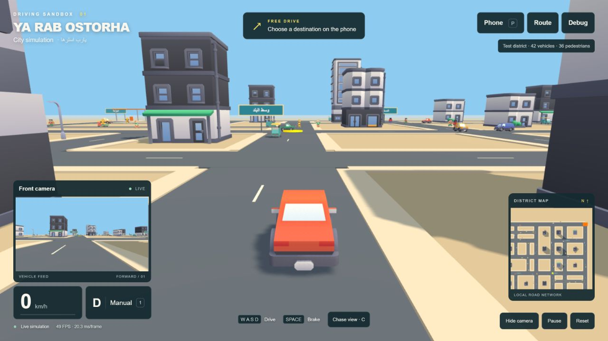

# Stage 1 validation — 2026-09-27

## Automated checks

- `npm test`: 16 tests passed (nine existing tests, seven driving/timing regressions).
- `python -m unittest discover -s tests -p "test_*.py"`: three API tests passed.
- JavaScript syntax checks and `git diff --check`: passed.
- Driving regression coverage: identical six-second travel at 30/60/144 rendering FPS, bounded catch-up after a stall, brake-before-reverse delay, speed limits, Space braking in both directions, forward/reverse steering, coasting, and a swept reverse collision guard.

## Live browser checks

Ran the real app through `python -m backend.server` in the Codex in-app browser at its default 1280×720 viewport. Inspected actual rendered screenshots and captured browser warning/error logs. No warnings or errors were captured in the tested session.

- Existing player, building, traffic, tuk-tuk and pedestrian GLBs loaded. Existing animation, moving traffic and front-camera images remained present.
- Repeated real W key presses moved the player forward; A/D inputs changed the heading while moving. S moved backward and the HUD displayed reverse gear (9 km/h observed). Space stopped the car. Arrow Up also moved it forward.
- Reversing while steering reached the road edge near x=16.5, z=-61.3; further reversing was stopped near z=-61.6 with `onRoad: true`. Forward input moved it back away from that contact. These are smoke checks, not exhaustive collision certification.
- C toggled the chase/front views; switching back restored the damped chase camera.
- P opened the phone with an empty input after correcting a stray-character shortcut bug. Entering `روح السوق` produced an A* route and activated the existing auto controller; the car progressed from spawn to approximately x=-16, z=-22.5 and waited at a red signal.
- Pause displayed the pause overlay. Two API observations 900 ms apart had identical player and actor positions. Resume and Reset restored playable manual operation.
- Hide camera / Show camera worked; Debug toggled the sensor view. Existing `/api/state` telemetry stayed connected.
- After assets/shaders loaded, spot observations were generally 37–49 FPS with both camera views, the minimap, 42 traffic agents and 36 pedestrians. Shader warm-up and a heavy automated key-input burst briefly ran below 30 FPS. This is a local observation, not a 60 FPS guarantee or cross-device benchmark.

## Visual corrections made during verification

Reduced over-bright initial lighting; removed fog from the overhead-map pass; disabled self-shadow reception on double-sided building facades to avoid striping; restricted traffic/pedestrian shadow casting to 60 m; kept the player grounded on the road; reset FPS sampling after browser-tab suspension so idle time is not reported as rendering time. The game remains a small, sparse kit-based test district. The busy Egyptian shop street in the reference belongs to later stages.

## Known scope limits

The existing simple traffic, circular dynamic safety bounds, auto controller and road graph are preserved and can still hesitate in congestion. Road-edge collision uses the player centre with a margin; it is deliberately an arcade approximation. The existing front view is not a new cockpit. No new vehicle models, wheel rigging, shop street, scenario manager, seeded experiments, ground-truth CV boxes or labs were added. The full asset-manager migration remains future work.

## Saved gameplay view

