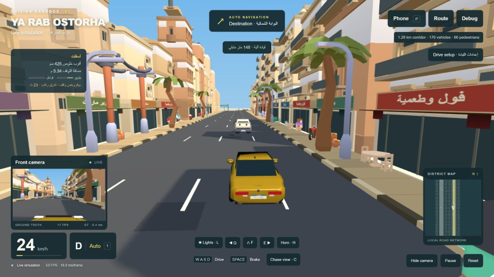
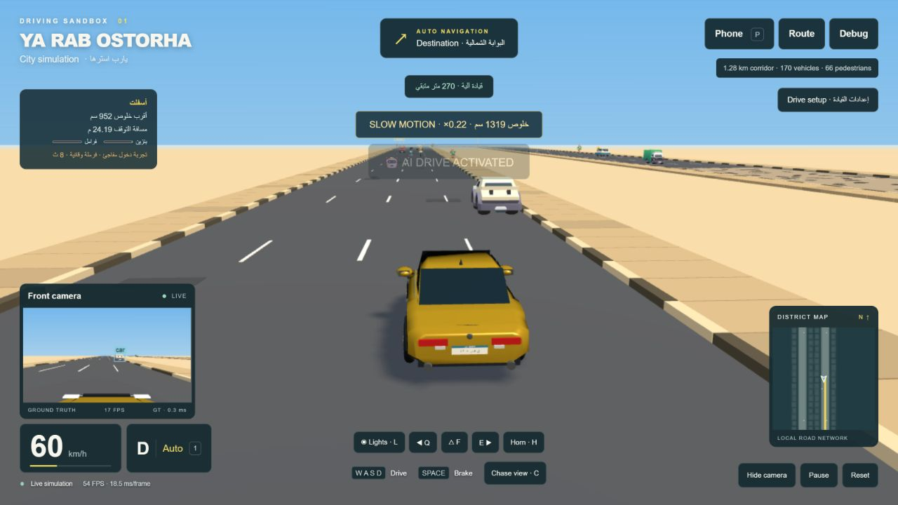

# Traffic and physical driving — 2026-10-06

This pass extends the existing Three.js simulator in place. There is no framework replacement, new runtime package, Blender step or build pipeline.

## Driving and measurements

- Force calculations use metres, seconds and m/s. The existing outer controller retains displacement per fixed 60 Hz tick. Throttle and brake pressure ramp progressively; drag, rolling resistance, grip, steering lock and brake-before-reverse affect the result.
- Requested auto speed is adjustable from 20 to 180 km/h. The route curvature, lead vehicle, signal, upcoming road surface and emergency layer can reduce actual speed. An unrestricted straight reaches over 170 km/h in the dynamics regression; the live city route is deliberately slower.
- The original player sedan measures 4.72 × 1.86 m with a 2.78 m wheelbase. Tyre/wheel animation, pitch, roll and sampled road-height response are visual suspension approximations, not a multibody tyre model. Mirrors extend beyond the simulation body envelope.
- Nearest clearance is edge-to-edge between oriented actor rectangles, displayed to the nearest centimetre. It is exact for those simplified rectangles, not centimetre-accurate sensing of the rendered mesh. Pedestrians use a 1.1 m square envelope. Static building/parked-car checks remain conservative AABBs.
- Predictive checks and sub-stepped movement reject observed overlap. Existing comfort-margin overlap permits parallel or escaping movement only when the actual body gap does not shrink. Safety checks can clamp movement in an emergency; no universal collision-free or physically perfect guarantee is claimed.

## Roads and traffic

- The original inner district connects to two extended arterial roads. End-to-end extent is 1.28 km; the spawn-to-north-gate trip is approximately 660 m. Side streets are 6.4 m wide and arterial sections are 14 m with extra lane markings.
- Five shared visual/physics surface types: asphalt, broken asphalt, cobbles, water and gravel. Surface-ahead sampling allows braking before entering a slow section. Roughness affects wheel/body movement and synthesized road noise.
- Default density is 170 traffic vehicles and 66 moving pedestrians. Settings can reduce or increase vehicle density. Nearby traffic updates at 30 Hz and distant traffic at 10 Hz; player integration stays at 60 Hz. Pedestrians and traffic check each other's occupancy.
- Vehicles follow leaders with an Intelligent Driver Model-style acceleration rule, retain their lane, obey alternating intersection phases, and avoid entering a blocked junction. Connected road-end curves and straight continuations replace dead-end stopping. No stuck timer rotates the player in a queue.
- Seed-42 incidents create temporary delivery/passenger stops, sudden braking, limited lateral incursions and a roadwork obstruction. They expire in simulation time. Roadworks use a stopped traffic actor as the collision obstacle; the cones are decorative. This is a traffic approximation, not a calibrated city traffic model. Extreme densities can still produce lengthy queues.

## Camera and equipment

- Near-impact prediction triggers a cinematic camera and global slow motion (0.22×, then 0.5×, then 1×). All simulation actors and signal/incident timers use the same scaled clock. Pause freezes that clock; the camera can be disabled.
- **Drive setup → تجربة تفادي سينمائية · إعادة ضبط الرحلة** explicitly resets to a repeatable cut-in fixture on the arterial road. It repositions nearby actors during setup; subsequent motion and braking use the normal simulation checks. The ordinary random-event button creates an event without resetting the trip.
- `L` toggles projected headlights; `Q`/`E` toggle signals; `F` toggles hazards; holding `H` sounds the synthesized two-tone horn. Auto turns show turn indicators. Brake/reverse lights follow actual state. Evening mode exposes the headlight beams. Engine/road audio starts after a browser gesture and can be muted.
- The front camera remains simulation ground truth, not computer vision. Its diagnostic feed and the north-up minimap remain available.

## Observed verification

- Automated suite: **29 JavaScript tests** and **5 Python API tests** passed. This includes analogue pressure, wet stopping distances, grip-limited steering, centimetre gaps, swept contact checks, queue restart, a kilometre-long route, corner following, road-end transitions, repeatable/expiring incidents, global cinematic time and isolated browser telemetry.
- A live default-density drive reached **البوابة الشمالية**, with the arrival message inspected in the browser. The live evening view showed headlight illumination; light and turn-signal button states changed correctly.
- A separate 60-second live observation with requested speed 180 km/h recorded movement from z=-28.25 to z=303.79, a maximum sampled speed of 57.9 km/h, and a minimum sampled clearance of 55 cm. Samples were 500 ms apart: this is observation evidence, not a proof that every sub-step is collision-free.
- That observation captured an organic cinematic trigger at z=167.42, predicted impact time 1.6 s, player speed 55.9 km/h. Global time scale changed to 0.22 and 0.5; speed decreased and normal driving resumed. The repeatable cut-in fixture also triggered the visible slow-motion notice in the browser.
- Rendering varies substantially with district density, assets loading, browser/GPU load and the camera feed. Optimized spot observations ranged roughly 17–42 FPS; lower transient values occurred. A 60 FPS target is not established. Use lower traffic density or hide the front camera when needed.

## Telemetry

`/api/state` retains the most recently reported browser state. Each browser also has a UUID in `document.body.dataset.telemetryClient`; use `/api/state?client=<uuid>` to avoid another open simulator window overwriting the observation. The server retains at most 16 client states.

New fields include `clearanceCm`, `throttle`, `brake`, `grip`, `surface`, `stoppingDistanceM`, `requestedSpeedKmh`, `plannedSpeedKmh`, `tripRemainingM`, `timeScale`, `cinematic`, `cinematicEvents`, `equipment` and `incidents`. Actor `vx`/`vz` are now m/s, and actor positions are reported to 0.01 m. `/api/frame` remains the most recently submitted unannotated front-camera JPEG across windows.

The default run and explicit fixture can be reset from the UI. Existing historical screenshots/validation are retained; they describe earlier builds. Asset licenses remain in [ATTRIBUTION.md](../public/assets/ATTRIBUTION.md).

