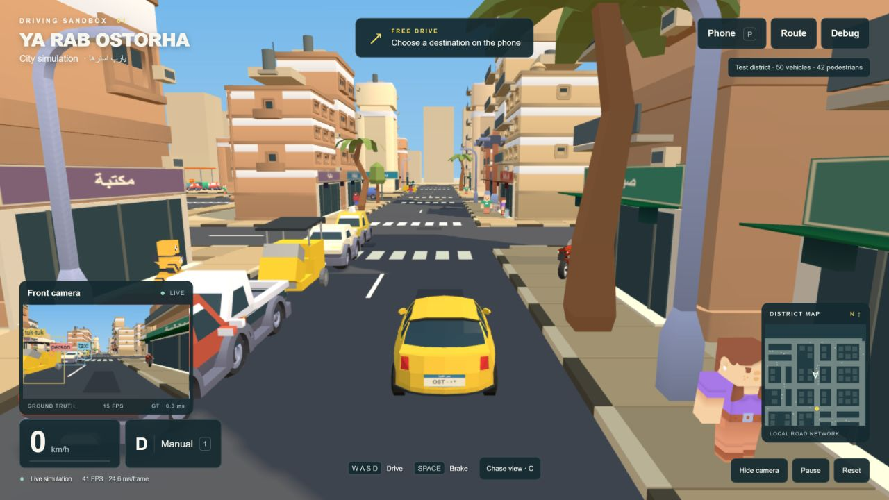

# Visual polish validation — 2026-09-29

## Scope

Polished the existing simulator in place. Driving, fixed-step timing, the traffic controller, pedestrian movement, A* navigation, phone, safety checks, controls and same-origin Python API remain. No project rebuild, new framework, Blender workflow or package dependency was introduced.

The initial screenshot showed five main weaknesses: a flat-looking player car, sparse street frontage, repeated cool facades, empty road/sidewalk surfaces, and camera/map panels occupying too much of the compact gameplay window.

## Implemented

- Quaternius player sedan (3,124 source triangles), yellow paint, dark glass/trim, silver rims, lights and Egyptian-style rear plate. Wheel pivots support rolling and front steering; braking lights and restrained body pitch/roll are visual only. Chase distance/FOV respond smoothly to speed.
- Warm hemisphere/sun lighting, local 1024px PCF soft shadows, gradient sky and subtle distant fog. Main streets have faded markings, crossings, repair patches, manhole covers, tiled shoulders and alternating curbs. Road collision geometry remains flat.
- Seed-42 frontage generation with eight building shapes, warm palette variants, roof structures, tanks, antennas, dishes, AC units and balconies. Far buildings use low-detail GLBs; the surrounding skyline is static.
- Ten Arabic shop signs rendered with CanvasTexture, reused Kenney awnings, shop windows/entrances, cafe tables/chairs, crates and fruit, bins, benches, planting, palms, poles and barriers.
- Nine traffic visual categories, including a motorcycle with a posed rider and a white/blue microbus with Arabic destination text. Tuk-tuk traffic uses the recognizable auto-rickshaw model. Initial district: 50 moving traffic agents and 42 pedestrians. Vehicle scales vary slightly; pedestrians use six existing skins and varied heights. Static standing shoppers and parking pockets add density without traffic AI.
- Parked cars, delivery vans and waiting tuk-tuks have simple static colliders in dedicated frontage pockets, clear of the road corridors.
- Smaller HUD panels, north-up canvas minimap, visible auto status, gentler destination ring, and compact camera labels. Route display can be hidden during auto driving without modifying its active path.
- Ground-truth camera boxes project known actor bounds and reject actors behind building colliders. The label processing time and camera FPS are measured. No confidence scores or neural-network latency are invented.

## Performance measures

Repeated assets use InstancedMesh. Static NPC parts sharing a material are merged; normalized integer GLB attributes are decoded before baking transforms. Assets, textures, materials and geometry are shared where practical. Detailed building instances are replaced at distance, dynamic shadows are limited to nearby actors, and the front view is cached in a render target capped at 20 updates/sec. The main view remains requestAnimationFrame-driven. The minimap avoids a third full 3D scene render.

Local spot checks after warm-up were roughly **29–37 FPS with the front camera visible**, and **41 FPS** in a camera-hidden observation. The camera itself ran around **13–15 FPS** under this load. An observed frame without a shadow/feed refresh used about **307 draw calls / 344k triangles**, compared with approximately **1,549 calls / 939k triangles** during the earlier unoptimized pass. Work varies by frame, view and traffic; these are spot observations, not a controlled cross-device benchmark. The preferred 60 FPS target is not established, and occasional sub-30 frames remain possible.

## Verification

- `npm test`: **17 passed**, including existing driving/safety/routing tests and a new seeded-layout regression checking repeatability, parcel separation and road clearance at multiple district extents.
- `python -m unittest discover -s tests -p "test_*.py"`: **3 passed**.
- JavaScript syntax checks and `git diff --check`: passed.
- Actual browser screenshots inspected after car, roads, buildings, shops, traffic, props and final passes. No browser warnings/errors captured in the final tested loads.
- W moved the player from z=-40 to approximately z=-36.8; reverse input later moved it back from its arrival area to z=12.4. Space stopped it. Front/chase camera, camera visibility and manual/auto switching worked.
- Entering `روح وسط البلد` in the phone activated auto mode, followed the route, and produced the arrival message. A subsequent drive showed 23–48 km/h during navigation through the new street.
- Pause: player position and all nearby actor states were identical across two API reads 850 ms apart. Resume/reset controls retained their original handlers.
- `/api/state` remained connected. `/api/frame` returned the correctly oriented unannotated front-camera JPEG, inspected visually.

## Practical limits

This remains the existing small research simulator. Traffic keeps its simple lane/wrap/avoidance behavior and can queue or hesitate. The existing front view is not a modeled cockpit. The supplied repository has no Test Lab, Decision Lab or scenario manager to preserve; those systems were not added during this visual pass. Camera boxes are simulation ground truth, not YOLO or pixel-based CV. Background buildings are decorative; exterior roof/AC details have no separate gameplay logic. The initial district fits within the requested local simulation radius; broader expansion behavior remains the existing system.

External assets and modifications are documented in [the attribution record](../public/assets/ATTRIBUTION.md), including the CC BY 3.0 Motorcycle and Van by Poly by Google. Keep the attribution file when distributing the game.

## Screenshots

Final reopen check (2026-10-06): restarted the local server and loaded a fresh browser tab. Arabic text, the player car, street assets, minimap and ground-truth camera rendered correctly; no console warnings/errors were captured. Re-ran the 17 JavaScript and 3 Python tests successfully. The stationary view showed approximately 40–41 FPS with the camera visible (15–17 camera FPS), a spot observation rather than a driving benchmark. Replaced the final gameplay screenshot with this current build.

- [Before](polish-before.png)
- [Player car](polish-01-car.png)
- [Roads](polish-03-roads.png)
- [Building frontage](polish-04-buildings.png)
- [Shops](polish-05-shops.png)
- [Traffic](polish-07-traffic.png)
- [Street activity](polish-09-street-life.png)

